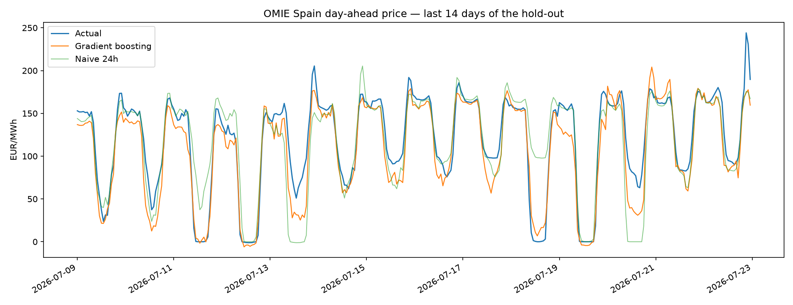

# OMIE Day-Ahead Electricity Price Forecasting (Spain)

Forecasting hourly day-ahead electricity prices for the Spanish zone of the Iberian market (MIBEL), using only public data from [OMIE](https://www.omie.es/), the Iberian day-ahead market operator.

Built as a hands-on introduction to power markets: honest baselines, a leakage-free information window, and an evaluation that a trading desk would recognise.

## Data

- **Source:** OMIE public daily files (`marginalpdbc_YYYYMMDD.1`), downloaded and cached by `src/download.py`. No API key needed.
- **Granularity:** since the EU switch to 15-minute market time units (October 2025) the files carry 96 periods/day; earlier files are hourly. Quarter-hours are averaged into hours so the whole history is comparable (`src/dataset.py`).
- **History used:** 418 delivery days (2025-05-29 → 2026-07-22), ~10,000 hourly prices.

## Honest forecasting setup

Prices for delivery day **D** clear at the **D-1** auction (published ~13:00 CET). A real forecast for D, made on the morning of D-1, already knows every price up to the end of D-1. Therefore **all features use lags ≥ 24h** — no leakage.

Price *levels* are non-stationary and tree ensembles cannot extrapolate outside their training range, so the model learns the **delta vs. the 24h-lagged price** (the naive anchor) with the remaining lags expressed relative to that anchor. This detail alone is what makes the model beat the naive benchmark across seasons.

## Results (28-day hold-out: 2026-06-25 → 2026-07-22)

| Model | MAE (EUR/MWh) | RMSE (EUR/MWh) | MAE vs naive-24h |
|---|---|---|---|
| Naive 24h (yesterday's price) | 18.11 | 28.54 | — |
| Naive 168h (last week) | 24.41 | 33.47 | −34.8% |
| **Gradient boosting (delta model)** | **15.48** | **21.06** | **+14.5%** |



The naive-24h baseline is genuinely hard to beat in this market (that is why it is the standard benchmark); a double-digit improvement using only price history and calendar features is in line with the academic literature.

## Run it

```bash
python -m venv .venv
.venv/Scripts/pip install -r requirements.txt   # Windows (use bin/ on Linux/Mac)
.venv/Scripts/python -m src.pipeline --days 420
```

Outputs: `data/processed/prices_hourly_es.csv`, `results/metrics.csv`, `results/forecast_last14d.png`.

## Roadmap

- Exogenous drivers: demand, wind and solar forecasts (ESIOS / ENTSO-E) — the main lever for further error reduction.
- Quantile forecasts (P10/P50/P90) for risk-aware decisions.
- Rolling-origin backtesting across full seasons.

## Author

Carlos Bustos — electrical engineering student (UCLM, Spain), focused on power systems and energy markets. Built with an AI-assisted workflow (Claude Code).
