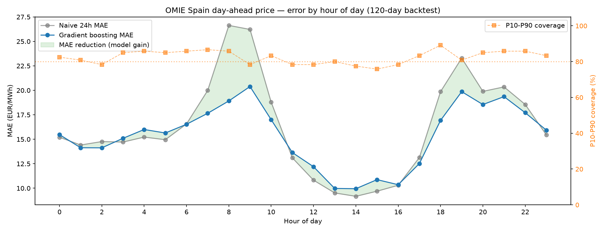

# OMIE Day-Ahead Electricity Price Forecasting (Spain)

Point **and probabilistic** day-ahead forecasts for the Spanish zone of the Iberian
electricity market (MIBEL), using only public data from [OMIE](https://www.omie.es/),
the market operator. The pipeline downloads real market prices, engineers a
leakage-free feature set, and evaluates the models with a **walk-forward backtest**
that a trading desk would recognise — a naive and a LASSO benchmark, a **conformally
calibrated P10–P90 interval**, and a **Diebold–Mariano significance test**, not just a
single point number.

**Headline (120-day walk-forward, weekly retrain, ~14 months of history):**

| Model | MAE (€/MWh) | RMSE (€/MWh) | vs. naive-24h |
|---|---|---|---|
| Naive 24h (yesterday's price) | 16.28 | 24.87 | — |
| LASSO autoregressive baseline | 15.83 | 21.34 | +2.8% MAE |
| **Gradient boosting (point)** | **15.37** | **21.25** | **+5.6% MAE** |

Probabilistic (gradient boosting): **pinball loss 4.83 €/MWh**, **P10–P90 coverage 82.5%**
(nominal 80%) after conformal calibration.

| Point forecast | Probabilistic forecast |
|---|---|
|  |  |

The gradient boosting model has the lowest error of the three, and the probabilistic
intervals are well-calibrated. But is a −5.6% point gain *real* or luck? That question —
and the honest answer — is below.

---

## Is the point gain statistically significant? (Not yet — and saying so is the point)

A "−5.6% MAE" headline is worthless without asking whether it could be noise. Hourly
forecast errors are strongly autocorrelated, so the **effective** sample is far smaller
than the 2,880 test hours. The [Diebold–Mariano](https://en.wikipedia.org/wiki/Diebold%E2%80%93Mariano_test)
test with a Newey–West (HAC) long-run variance is the honest way to check
(`src/forecast.py: diebold_mariano`):

| Comparison | MAE (a) | MAE (b) | DM stat | p-value | a better at 5%? |
|---|---|---|---|---|---|
| Gradient boosting vs naive | 15.37 | 16.28 | −1.34 | 0.18 | **No** |
| Gradient boosting vs LASSO | 15.37 | 15.83 | −1.20 | 0.23 | **No** |
| LASSO vs naive | 15.83 | 16.28 | −0.86 | 0.39 | **No** |

The ranking is consistent (boosting < LASSO < naive in error), but on this history none of
the gaps is statistically distinguishable from zero at the 5% level. That is the correct,
unglamorous conclusion — and exactly what a desk needs to hear before trusting a model with
real money.

Why report a *negative* result so prominently? Because an earlier **28-day summer** window
of this same pipeline showed a much flashier **+15% MAE**. Extending the backtest to 120
days and running the DM test revealed that number was optimistic — a seasonal artifact, not
a durable edge. That is the entire reason to backtest over a long, varied window and to test
significance, rather than quote one lucky month. The most likely path to a *significant*
edge is the exogenous drivers on the roadmap (demand / wind / solar), or a price history
longer than the ~14 months OMIE exposes here.

## Why this is a fair evaluation (and not a leaky one)

Prices for delivery day **D** clear at the **D-1** auction (published ~13:00 CET the
day before). A real forecast for D, produced on the morning of D-1, already knows
every price up to the end of D-1 — and nothing after. Three design choices keep the
evaluation honest:

1. **Feature window ≥ 24 h.** Every predictor is a lag of 24 hours or more, so no
   feature ever uses information that wouldn't exist at forecast time. No leakage.
2. **Delta target.** Price *levels* are non-stationary and tree ensembles can't
   extrapolate beyond their training range, so the models learn the **correction
   against the 24h-lagged price** (the naive benchmark). Both the boosting and the LASSO
   predict this delta, so all three models are compared on identical, honest footing.
3. **Walk-forward backtest.** Instead of one lucky train/test split, the models are
   refit weekly and always scored on days they have *never seen*. The reported numbers
   are the average over a rolling 120-day out-of-sample window.

The naive-24h benchmark is genuinely hard to beat in this market (it *is* the standard
reference), so a single-digit MAE reduction using only price history and calendar features
is a modest, honest result — and the harness is built to measure it without fooling itself.

## Probabilistic forecasting

A point forecast is not enough for a trading or risk decision — you need the
*distribution*. The pipeline trains gradient-boosting **quantile** models (P10/P50/P90)
and then applies a **split-conformal calibration**: the raw quantile band is overconfident
(empirical coverage well short of the 80% nominal), so a width multiplier is learned on
held-out data and applied to the interval. Calibrated coverage lands at **82.5%**, and the
band widens in the volatile ramps and solar-driven troughs — where uncertainty really is
higher.

## Where the model earns its keep (error by hour of day)

A single headline MAE hides *where* the gain comes from. Breaking the 120-day backtest down
by hour of day tells the real story:



- **In the flat hours the model can't add much.** Overnight (00–06h) and especially the
  low, stable midday hours (11–16h, naive MAE ~10 €/MWh) leave little structure to exploit —
  the boosting model tracks the naive and, in a few midday hours, is even marginally worse.
- **It earns its keep in the ramps.** In the morning solar build-up the naive error blows up
  to **~27 €/MWh** while the model holds ~19 (hour 8: **−29%**), and the evening ramp shows
  the same pattern (hours 18–19: **−15%**). Exactly the volatile hours a trader cares about
  are the hours the model helps most — which is also *why* the aggregate gain is modest: the
  model wins where errors are large and ties where they are small.
- **Coverage is honest and fairly flat.** Over 120 days the P10–P90 band runs 76–89% per
  hour around the 80% target — steadier than on a short window.

Numbers per hour are in `results/metrics_by_hour.csv`.

### Experiment: does hour-conditional calibration help? (No — and that's the point)

The uneven coverage invites calibrating the conformal width **per hour** instead of
globally. It's implemented (`backtest(..., calibration="hourly")`) and tested head-to-head
on the same models over the 120-day window:

| Calibration | Pinball ↓ | Overall coverage | Hourly coverage spread (mean \|cov−80%\|) |
|---|---|---|---|
| **Global (shipped)** | **4.83** | 82.5% | 3.7 pp |
| Hourly | 4.98 | 79.1% | 3.0 pp |

Per-hour calibration flattens the hourly spread a little, but with only a **21-day**
calibration window it **overfits**: the proper scoring rule (pinball) gets *worse*. So the
shipped default stays **global**, and the hourly option is kept for when there's enough
calibration history (or a shrinkage prior toward the global width) to estimate 24
multipliers without chasing noise. Rejecting a plausible idea on out-of-sample evidence is
the point — not every added knob is an improvement.

## Data

- **Source:** OMIE public daily files (`marginalpdbc_YYYYMMDD.1`), downloaded and cached
  by `src/download.py`. No API key required.
- **Granularity:** since the EU switch to 15-minute market time units (Oct 2025) the
  files carry 96 periods/day; earlier files are hourly. Quarter-hours are averaged into
  hours so the whole history is comparable (`src/dataset.py`).
- **History used:** ~420 delivery days (~10,000 hourly prices).

## Run it

```bash
python -m venv .venv
.venv/Scripts/pip install -r requirements.txt      # Windows (use bin/ on Linux/Mac)
.venv/Scripts/python -m src.pipeline --days 420 --test-days 120 --retrain-every 7
```

Outputs (in `results/`): `metrics.csv`, `metrics_probabilistic.csv`, `metrics_by_hour.csv`,
`significance_dm.csv`, `backtest_predictions.csv`, and the three plots above.

## Project layout

```
src/
  download.py    # fetch + cache OMIE daily price files
  dataset.py     # parse (hourly + 15-min formats) into a tidy hourly series
  forecast.py    # features, GB + quantile + LASSO models, conformal calibration,
                 # walk-forward backtest, scoring, Diebold-Mariano test
  pipeline.py    # end-to-end: download -> dataset -> backtest -> metrics + plots
```

## Roadmap

- **Exogenous drivers** — demand, wind and solar forecasts from ENTSO-E and ESIOS (REE).
  The biggest remaining lever on point error, and the most likely route to a *statistically
  significant* edge over naive.
- **Stronger literature benchmarks** — a LASSO baseline and a Diebold–Mariano test are in
  place; next is the full LEAR / DNN from [`epftoolbox`](https://github.com/jeslago/epftoolbox).
- **Hour-conditional conformal calibration with shrinkage** — the per-hour version is
  implemented but overfits a 21-day window (see the experiment above); shrink each hour's
  width toward the global one, or calibrate on more history.
- **More history / rolling-origin backtest** — the DM test shows 120 days still lacks the
  power to prove significance; a longer price record would settle it.

## Author

Carlos Bustos — electrical engineering student (UCLM, Spain), focused on power systems
and energy markets. Built with an AI-assisted workflow.
