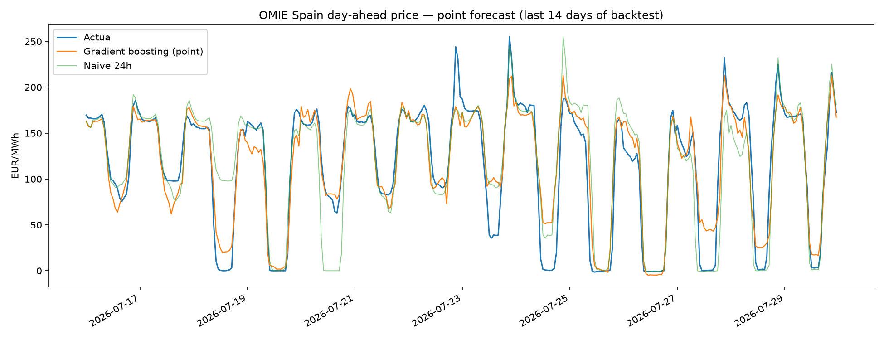
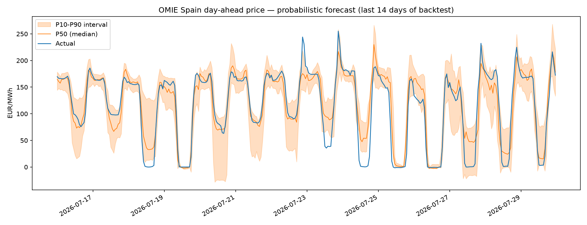

# OMIE Day-Ahead Electricity Price Forecasting (Spain)

Point **and probabilistic** day-ahead forecasts for the Spanish zone of the Iberian
electricity market (MIBEL), using only public data from [OMIE](https://www.omie.es/),
the market operator. The pipeline downloads real market prices, engineers a
leakage-free feature set, and evaluates the models with a **walk-forward backtest**
that a trading desk would recognise — including a **conformally calibrated P10–P90
interval**, not just a point number.

**Headline (28-day walk-forward, weekly retrain, 418 days of history):**

| Model | MAE (€/MWh) | RMSE (€/MWh) | vs. naive-24h |
|---|---|---|---|
| Naive 24h (yesterday's price) | 19.14 | 30.17 | — |
| **Gradient boosting (point)** | **16.26** | **22.39** | **+15.1% MAE** |

Probabilistic: **pinball loss 5.29 €/MWh**, **P10–P90 coverage 81.4%** (nominal 80%) after conformal calibration.

| Point forecast | Probabilistic forecast |
|---|---|
|  |  |

---

## Why this is a fair evaluation (and not a leaky one)

Prices for delivery day **D** clear at the **D-1** auction (published ~13:00 CET the
day before). A real forecast for D, produced on the morning of D-1, already knows
every price up to the end of D-1 — and nothing after. Three design choices keep the
evaluation honest:

1. **Feature window ≥ 24 h.** Every predictor is a lag of 24 hours or more, so no
   feature ever uses information that wouldn't exist at forecast time. No leakage.
2. **Delta target.** Price *levels* are non-stationary and tree ensembles can't
   extrapolate beyond their training range, so the models learn the **correction
   against the 24h-lagged price** (the naive benchmark). This one detail is what makes
   the model beat the naive baseline across seasons instead of drifting with the level.
3. **Walk-forward backtest.** Instead of one lucky train/test split, the model is
   refit weekly and always scored on days it has *never seen*. The reported numbers
   are the average over a rolling 28-day out-of-sample window.

The naive-24h benchmark is genuinely hard to beat in this market (it *is* the standard
reference), so a double-digit MAE reduction using only price history and calendar
features is a solid, honest result.

## Probabilistic forecasting

A point forecast is not enough for a trading or risk decision — you need the
*distribution*. The pipeline trains gradient-boosting **quantile** models (P10/P50/P90)
and then applies a **split-conformal calibration**: the raw quantile band is
overconfident (empirical coverage ≈ 64% vs. a nominal 80%), so a width multiplier is
learned on held-out data and applied to the interval. Calibrated coverage lands at
**81.4%**, and the band visibly widens in volatile ramps and the solar-driven zero-price
troughs — where uncertainty really is higher.

## Data

- **Source:** OMIE public daily files (`marginalpdbc_YYYYMMDD.1`), downloaded and cached
  by `src/download.py`. No API key required.
- **Granularity:** since the EU switch to 15-minute market time units (Oct 2025) the
  files carry 96 periods/day; earlier files are hourly. Quarter-hours are averaged into
  hours so the whole history is comparable (`src/dataset.py`).
- **History used:** 418 delivery days (~10,000 hourly prices).

## Run it

```bash
python -m venv .venv
.venv/Scripts/pip install -r requirements.txt      # Windows (use bin/ on Linux/Mac)
.venv/Scripts/python -m src.pipeline --days 420 --test-days 28 --retrain-every 7
```

Outputs (in `results/`): `metrics.csv`, `metrics_probabilistic.csv`,
`backtest_predictions.csv`, and the two plots above.

## Project layout

```
src/
  download.py    # fetch + cache OMIE daily price files
  dataset.py     # parse (hourly + 15-min formats) into a tidy hourly series
  forecast.py    # features, point + quantile models, conformal calibration, backtest, scoring
  pipeline.py    # end-to-end: download -> dataset -> backtest -> metrics + plots
```

## Roadmap

- **Exogenous drivers** — demand, wind and solar forecasts from ENTSO-E and ESIOS
  (REE); the biggest remaining lever on point error.
- **Benchmark vs. the literature** — compare against LEAR / DNN from
  [`epftoolbox`](https://github.com/jeslago/epftoolbox) with a Diebold–Mariano test.
- **Rolling-origin backtest across full seasons** and per-hour error analysis.

## Author

Carlos Bustos — electrical engineering student (UCLM, Spain), focused on power systems
and energy markets. Built with an AI-assisted workflow.
